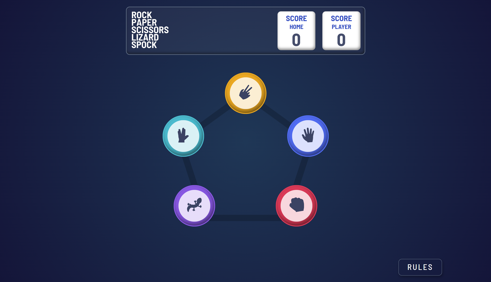

# Frontend Mentor - Rock Paper Scissors

## Table of Contents

- [Overview](#overview)
  - [Screenshot](#screenshot)
  - [Links](#links)
- [My Process](#my-process)
  - [Built With](#built-with)
  - [What I Learned](#what-i-learned)
  - [Continued Development](#continued-development)
  - [Useful Resources](#useful-resources)
- [Author](#author)
- [Acknowledgments](#acknowledgments)

## Overview

This project is a modern and interactive implementation of the classic "Rock, Paper, Scissors" game. It was developed as part of a Frontend Mentor challenge to enhance skills in React, TypeScript, and SCSS while incorporating advanced state management and localStorage for persistence.

### Screenshot

### Links

- Solution URL: [Frontend Mentor Solution](https://www.frontendmentor.io/challenges/rock-paper-scissors-game-pTgwgvgH)
- Live Site URL: [Live Demo](https://frontend-mentor-rock-paper-scissors.vercel.app/)

## My Process

I approached this project by focusing on creating a smooth and engaging user experience, leveraging React for dynamic gameplay and SCSS for a polished design. I prioritized accessibility and responsive design for a wide range of devices.

### Built With

- **React**: For building reusable UI components.
- **TypeScript**: To ensure type safety and code reliability.
- **SCSS**: For modular and maintainable styling.
- **Vite**: As a fast development and build tool.
- **LocalStorage**: To persist game scores and states across sessions.

### What I Learned

This project helped me enhance my skills in:

- **Dynamic State Management**: Managing game states effectively using React.
- **LocalStorage Integration**: Implementing persistence for user scores.
- **Accessibility Features**: Adding ARIA labels and keyboard navigation for inclusivity.
- **Responsive Design**: Using SCSS to create layouts optimized for various screen sizes.

### Continued Development

Future enhancements include:

- **Extended Gameplay**: Adding more options like "Lizard" and "Spock" for advanced rules.
- **Animations**: Introducing smooth animations for move selection and result display.
- **Multiplayer Mode**: Allowing players to compete with friends online.

### Useful Resources

- [MDN Web Docs](https://developer.mozilla.org/en-US/) - Comprehensive web development resources.
- [CSS-Tricks](https://css-tricks.com/) - Practical tutorials and tips for CSS.
- [Frontend Mentor](https://www.frontendmentor.io/) - Source of inspiration and challenges.

## Author

- **Peter GodsPower**  
  GitHub: [@TheBeyonder616](https://github.com/TheBeyonder616)

## Acknowledgments

Special thanks to Frontend Mentor for providing the challenge and to the web development community for valuable resources and inspiration.
